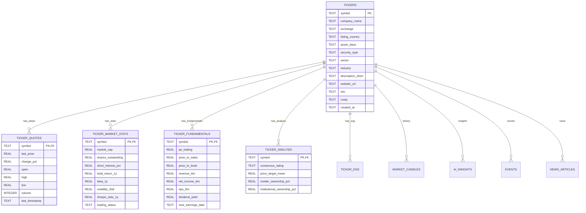

# Database Model (SQLite Adaptation - Elite Ticker Spec)

## Overview
This database model supports the "Elite Ticker DTO" specification, extending the previous schema to support deep financial metadata, fundamentals, and risk metrics.
It adheres to the "Satellite Table" pattern to avoid a single monolithic table, while remaining compatible with SQLite.

**Key Adaptations for SQLite:**
- **Types**: `TEXT` (UUID/Enum/Date), `REAL` (Decimal), `INTEGER` (Boolean/Int).
- **JSON**: Used for less frequently queried, deeply nested structures (like `identifiers` alt-tickers, or `esg` details) to keep the schema cleaner where appropriate, though most "Elite" fields are mapped to columns for queryability.

---

## Mermaid Entity-Relationship Diagram



---

## DBML Schema (Detailed)

```dbml
Project NeuralTicker_SQLite_Pro {
  database_type: 'SQLite'
  Note: 'Elite Schema: Normalized for Financial Depth'
}

// --------------------------------------------------------
// CORE TICKER MASTER
// --------------------------------------------------------
Table tickers {
  symbol text [pk]
  company_name text
  exchange text
  exchange_mic text
  listing_country text
  currency text

  // Classification
  asset_class text
  security_type text
  sector text
  industry text
  gics_sector text
  style_box text

  // Identifiers
  isin text
  cusip text
  cik text
  figi text

  // Metadata
  description_short text
  website_url text
  headquarters_country text
  founded_year integer
  employees integer

  updated_at text
}

// --------------------------------------------------------
// MARKET DATA SATELLITES
// --------------------------------------------------------

// Real-time / Snapshot Quote
Table ticker_quotes {
  symbol text [pk, ref: > tickers.symbol]
  last_price real
  last_size integer
  last_timestamp text

  open real
  high real
  low real
  prev_close real

  bid real
  ask real

  volume integer
  avg_vol_30d integer

  vwap real
  high_52wk real
  low_52wk real

  change_pct real

  is_delayed integer [note: 'boolean']
}

// Derived Metrics (Performance, Risk, Trading Stats)
Table ticker_market_stats {
  symbol text [pk, ref: > tickers.symbol]

  // Market Cap & Shares
  market_cap real
  shares_outstanding real
  float_shares real

  // Returns
  total_return_1d real
  total_return_ytd real
  total_return_1y real
  total_return_3y_cagr real

  // Risk
  beta_1y real
  volatility_30d real
  sharpe_ratio_1y real
  max_drawdown_1y real

  // Short Interest
  short_interest_shares real
  short_interest_pct_float real

  trading_status text
}

// --------------------------------------------------------
// FUNDAMENTAL DATA SATELLITES
// --------------------------------------------------------

Table ticker_fundamentals {
  symbol text [pk, ref: > tickers.symbol]

  // Valuation
  pe_trailing real
  pe_forward real
  ps_ttm real
  pb_ratio real
  ev_to_ebitda real

  // Per Share
  eps_ttm real
  book_value_per_share real

  // P&L
  revenue_ttm real
  net_income_ttm real
  gross_margin_pct real
  operating_margin_pct real
  net_margin_pct real

  // Balance Sheet
  total_assets real
  total_debt real
  cash_equivalents real
  debt_to_equity real
  current_ratio real

  // Growth
  revenue_cagr_3y real
  eps_cagr_3y real

  last_updated text
}

// Corporate: Dividends, Earnings, Splits
Table ticker_corporate {
  symbol text [pk, ref: > tickers.symbol]

  // Dividend Profile
  has_dividend integer
  div_yield_fwd real
  div_rate_annual real
  payout_ratio real
  div_frequency text
  ex_div_date text
  pay_date text
  consecutive_growth_years integer

  // Earnings Profile
  next_earnings_date text
  last_eps_surprise_pct real

  // Actions
  last_split_date text
  last_split_ratio text
}

// --------------------------------------------------------
// ANALYSIS SATELLITES
// --------------------------------------------------------

Table ticker_analysis {
  symbol text [pk, ref: > tickers.symbol]

  // Ratings
  consensus_rating text [note: 'BUY, HOLD...']
  analyst_count integer
  price_target_mean real
  implied_upside_pct real

  // Ownership
  insider_ownership_pct real
  inst_ownership_pct real
  net_insider_buy_3m real
}

Table ticker_esg {
  symbol text [pk, ref: > tickers.symbol]
  esg_score_total real
  esg_score_env real
  esg_score_soc real
  esg_score_gov real
  controversy_level integer
  carbon_intensity real
}

// --------------------------------------------------------
// EXISTING TABLES (Unchanged functionality)
// --------------------------------------------------------

Table market_candles {
  symbol text [ref: > tickers.symbol]
  time text
  open real
  high real
  low real
  close real
  volume integer
  indexes {
    (symbol, time) [pk]
  }
}

Table ai_insights {
  id text [pk]
  symbol text [ref: > tickers.symbol]
  agent_type text
  neural_rating integer
  sentiment_score real
  analyst_sentiment text
  technical_signal text
  news_summary text
  created_at text
}

Table news_articles {
  id text [pk]
  symbol text [ref: > tickers.symbol]
  title text
  source text
  published_at text
  url text
  sentiment_score real
  summary text
}

Table events {
  id text [pk]
  symbol text [ref: > tickers.symbol]
  event_type text
  event_date text
  title text
}

Table users {
  id text [pk]
  email text
  tier text
  credits integer
}

Table portfolios {
  id text [pk]
  user_id text
  name text
}

Table portfolio_positions {
  id text [pk]
  portfolio_id text
  symbol text
  quantity real
  avg_buy_price real
}

Table user_api_keys {
  id text [pk]
  user_id text
  provider text
  encrypted_key text
  is_active integer
}
```
