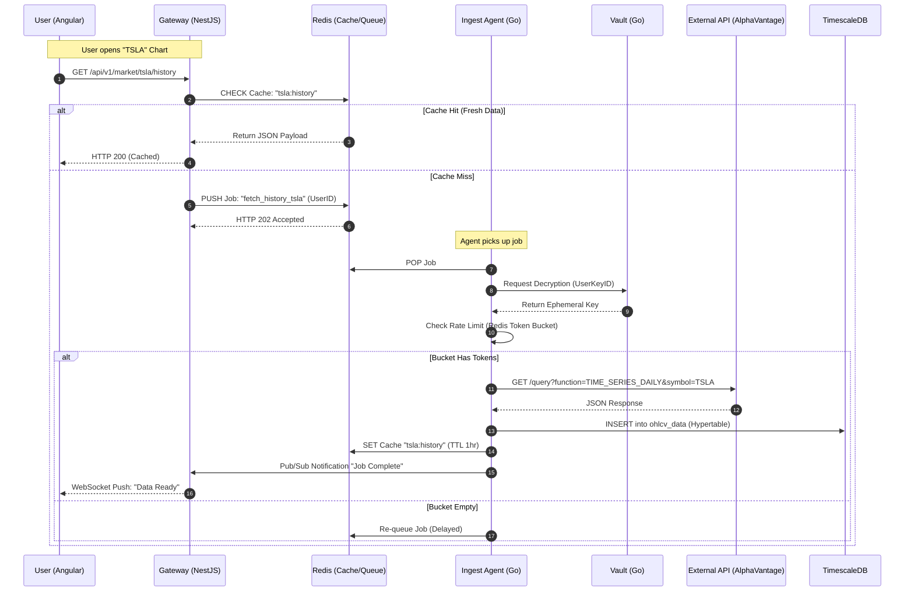
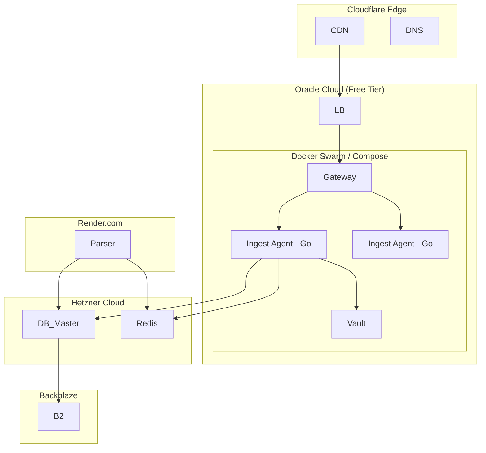

# 9. Conclusion
The architecture of Neural-Ticker.com represents a sophisticated response to the economic constraints of the retail financial data market. By fusing a Community-Driven BYOK Model with a high-performance Microservices Mesh, the platform achieves institutional-grade capabilities—real-time tracking, AI-driven sentiment analysis, and deep historical charting—at a fraction of the traditional cost.

The selection of Angular and IBM Carbon ensures the user experience rivals professional terminals, while the backend trio of NestJS, Go, and TimescaleDB provides the necessary throughput, type safety, and data integrity. The rigorous security architecture surrounding the Vault ensures that while the community shares the burden of data connectivity, they do not share the risk of credential compromise. With a break-even point of fewer than 10 users, this architecture is not only technically sound but commercially resilient.

# 10. Appendix: Mermaid Visualization Charts

## 10.1 System Sequence: User Request to Data Display

## 10.2 Infrastructure Deployment Diagram

## Works cited
- Alpha Vantage: Free Stock APIs in JSON & Excel, accessed December 2, 2025, https://www.alphavantage.co/
- API credits limits | Twelve Data Support, accessed December 2, 2025, https://support.twelvedata.com/en/articles/5194820-api-credits-limits
- Navigating the Challenges of Alpha Vantage API Call Limits Effectively - APIPark, accessed December 2, 2025, https://apipark.com/technews/ekqZjDgp.html
- Dashboards - Carbon Design System, accessed December 2, 2025, https://carbondesignsystem.com/data-visualization/dashboards/
- Carbon Design System, accessed December 2, 2025, https://carbondesignsystem.com/
- API Documentation | Finnhub - Free APIs for realtime stock, forex, and cryptocurrency. Company fundamentals, economic data, and alternative data., accessed December 2, 2025, https://finnhub.io/docs/api
- carbon-design-system · GitHub Topics, accessed December 2, 2025, https://github.com/topics/carbon-design-system
- Proposed candlestick chart · Issue #597 · carbon-design-system/carbon-charts - GitHub, accessed December 2, 2025, https://github.com/carbon-design-system/carbon-charts/issues/597
- Simple charts - Carbon Design System, accessed December 2, 2025, https://v10.carbondesignsystem.com/data-visualization/simple-charts/
- Lightweight Charts™ library - TradingView, accessed December 2, 2025, https://www.tradingview.com/lightweight-charts/
- Differences between Node.js and Golang (Go) from the perspective of an experienced developer. - DEV Community, accessed December 2, 2025, https://dev.to/mearjuntripathi/differences-between-nodejs-and-golang-go-from-the-perspective-of-an-experienced-developer-dcc
- Go vs Node.js for Microservices: an Exhausting Comparison - Artjoker, accessed December 2, 2025, https://artjoker.net/blog/go-vs-nodejs-in-building-microservices-an-exhausting-comparison/
- Go vs Node.js for Web Scraper project : r/golang - Reddit, accessed December 2, 2025, https://www.reddit.com/r/golang/comments/13d8gsc/go_vs_nodejs_for_web_scraper_project/
- Compare PostgreSQL vs TimescaleDB - InfluxDB, accessed December 2, 2025, https://www.influxdata.com/comparison/postgres-vs-timescaledb/
- [Managing Time-Series Data: Why TimescaleDB Beats PostgreSQL] - Mad Devs, accessed December 2, 2025, https://maddevs.io/writeups/time-series-data-management-with-timescaledb/
- Comparison with PostgreSQL - 《TimescaleDB v2.9 Documentation》 - 书栈网 · BookStack, accessed December 2, 2025, https://www.bookstack.cn/read/timescaledb-2.9-en/613b9fa85c670476.md
- API Keys Security & Secrets Management Best Practices - GitGuardian Blog, accessed December 2, 2025, https://blog.gitguardian.com/secrets-api-management/
- Oracle Cloud Free Tier, accessed December 2, 2025, https://www.oracle.com/cloud/free/
- Always Free Resources - Oracle Help Center, accessed December 2, 2025, https://docs.oracle.com/iaas/Content/FreeTier/freetier_topic-Always_Free_Resources.htm
- Secure vps hosting made in Germany - Hetzner, accessed December 2, 2025, https://www.hetzner.com/cloud-made-in-germany/
- Cloud Storage Pricing Comparison: AWS S3, GCP, Azure, and B2 - Backblaze, accessed December 2, 2025, https://www.backblaze.com/cloud-storage/pricing
- Cloudfare r2 vs Blackblaze B2 for social media app? : r/CloudFlare - Reddit, accessed December 2, 2025, https://www.reddit.com/r/CloudFlare/comments/1ja4n3a/cloudfare_r2_vs_blackblaze_b2_for_social_media_app/
- Render Features & Best Alternatives (2025) - srvrlss, accessed December 2, 2025, https://www.srvrlss.io/provider/render/
