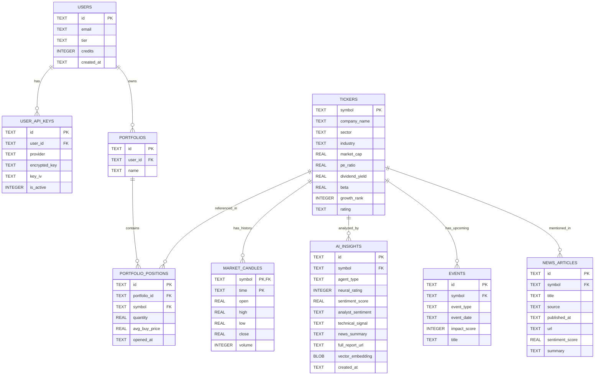

# Database Model (SQLite Adaptation)

## Overview
This database model adapts the "Hybrid Storage Model" (PostgreSQL + TimescaleDB) defined in the design documentation for a **local SQLite environment**.
It supports the full functional scope (User, Market Data, AI Insights, Portfolio, News) while adhering to SQLite's type system.

**Key Adaptations for SQLite:**
- **UUIDs**: Stored as `TEXT`.
- **Timestamps**: Stored as `DATETIME` (ISO8601 strings) or `INTEGER` (Unix Epoch), depending on TypeORM configuration. We assume ISO8601 `TEXT` for readability in this spec.
- **Decimals/Floats**: Stored as `REAL`.
- **Booleans**: Stored as `INTEGER` (0 or 1).
- **Vectors**: Stored as `BLOB` (Binary) or `TEXT` (JSON representation), as SQLite lacks native vector types.
- **JSON**: Stored as `TEXT`.

---

## Mermaid Entity-Relationship Diagram



---

## DBML Schema (Detailed)

```dbml
Project NeuralTicker_SQLite {
  database_type: 'SQLite'
  Note: 'Full Schema adapted for local SQLite MVP'
}

// --------------------------------------------------------
// USER & ACCESS LAYER
// --------------------------------------------------------
Table users {
  id text [pk, note: 'UUID']
  email text [unique, not null]
  tier text [default: 'free', note: 'free, pro, contributor']
  credits integer [default: 0]
  created_at text [note: 'ISO8601 Timestamp']
}

Table user_api_keys {
  id text [pk, note: 'UUID']
  user_id text [ref: > users.id]
  provider text [note: 'openai, gemini, alphavantage, finnhub']
  encrypted_key text
  key_iv text
  is_active integer [note: 'Boolean: 0 or 1']
}

// --------------------------------------------------------
// PORTFOLIO LAYER
// --------------------------------------------------------
Table portfolios {
  id text [pk, note: 'UUID']
  user_id text [ref: > users.id]
  name text [default: 'My Portfolio']
}

Table portfolio_positions {
  id text [pk, note: 'UUID']
  portfolio_id text [ref: > portfolios.id]
  symbol text [ref: > tickers.symbol]
  quantity real
  avg_buy_price real
  opened_at text [note: 'ISO8601 Timestamp']
}

// --------------------------------------------------------
// MARKET DATA LAYER
// --------------------------------------------------------
Table tickers {
  symbol text [pk]
  company_name text
  sector text
  industry text
  market_cap real
  pe_ratio real
  dividend_yield real
  beta real
  growth_rank integer
  rating text
}

// Note: In SQLite, we use a composite Primary Key (symbol, time)
Table market_candles {
  symbol text [ref: > tickers.symbol]
  time text [note: 'ISO8601 Timestamp']
  open real
  high real
  low real
  close real
  volume integer

  indexes {
    (symbol, time) [pk]
  }
}

// --------------------------------------------------------
// AI AGENT LAYER
// --------------------------------------------------------
Table ai_insights {
  id text [pk, note: 'UUID']
  symbol text [ref: > tickers.symbol]
  agent_type text [note: 'system, community']

  // Scores
  neural_rating integer [note: '0-100']
  sentiment_score real [note: '0.0-100.0']

  // Structured Analysis
  analyst_sentiment text
  technical_signal text
  news_summary text

  // Deep Research
  full_report_url text
  vector_embedding blob [note: 'Serialized vector or binary']

  created_at text [note: 'ISO8601 Timestamp']
}

// --------------------------------------------------------
// NEWS & EVENTS LAYER
// --------------------------------------------------------
Table events {
  id text [pk, note: 'UUID']
  symbol text [ref: > tickers.symbol]
  event_type text [note: 'earnings, dividend, split']
  event_date text [note: 'ISO8601 Timestamp']
  impact_score integer [note: '1-10']
  title text
}

Table news_articles {
  id text [pk, note: 'UUID']
  symbol text [ref: > tickers.symbol, note: 'Nullable if general news']
  title text
  source text
  published_at text [note: 'ISO8601 Timestamp']
  url text
  sentiment_score real [note: '-1.0 to 1.0']
  summary text
}
```
