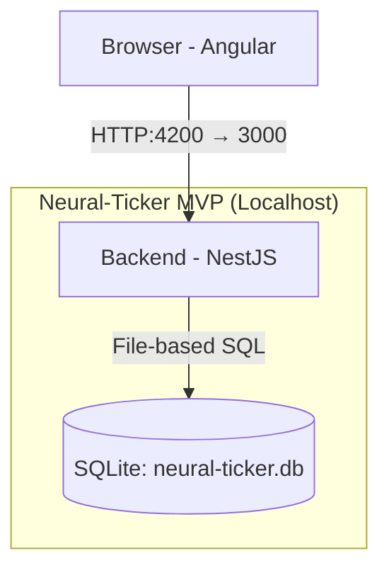

# Neural-Ticker MVP – Localhost Specification (SQLite Edition)

This document defines a **minimum viable product (MVP)** for Neural-Ticker that you can run entirely on **localhost** with:

- Angular frontend
- NestJS backend
- **SQLite** database via TypeORM (no Docker required for v0)

The goal is a **vertical slice*

> User logs in → opens `/dashboard/` → and sees dashboard with a list of tickers.

> User clicks on a ticker → opens `/ticker/NVDA` → sees candlestick chart + current price + a simple AI “Neural Rating” + one-paragraph AI summary.

No BYOK, no multi-cloud, no StockTwits/Reddit, no Go microservices – just the core loop.

---

## 1. MVP Scope

### 1.1 Included Features

- **Authentication**
  - Email/password sign-up & login.
  - JWT-based auth (access token only is enough for MVP).

- **Tickers & Market Data (single provider or seeded data)**
  - Hardcoded subset of tickers: e.g., `AAPL`, `NVDA`, `TSLA`.
  - Backend endpoints to:
    - Fetch OHLCV candles for a ticker (from SQLite; initially seeded via script or a simple external API call).
    - Fetch the latest “snapshot” (price, change%), even if mocked or derived from last candle.

- **AI Insight (simplified)**
  - Simple “Neural Rating” (0–100) computed from:
    - Price momentum (e.g., last N candles).
  - One AI summary string:
    - For MVP this can be either:
      - Hardcoded template (no external LLM), or
      - A call to your personal OpenAI key (configured via `.env`).

- **Frontend**
  - Angular dashboard with:
    - `/login` – Login form.
    - `/ticker/:symbol` – Stock detail page with:
      - Candlestick chart (TradingView Lightweight Charts).
      - Current price and % change.
      - “Neural Rating” indicator (gauge or simple pill).
      - AI summary box.

### 1.2 Explicit Non-Goals (for MVP)

- No BYOK (user-provided API keys).
- No multi-provider mesh (only one price source or static seeding).
- No RAG/vector search.
- No portfolios/positions yet (only ticker view).
- No system/community agent split.
- No background workers cluster or Go/Python microservices (all in single NestJS app).
- No Postgres/Timescale in v0 (that comes later as a migration path).

---

## 2. Tech Stack (MVP)

- **Frontend**
  - Angular 18 (Standalone Components).
  - IBM Carbon Design System (`carbon-components` + basic theming).
  - TradingView Lightweight Charts (for candlesticks).

- **Backend**
  - NestJS (Node.js 20+).
  - REST API only (no GraphQL for MVP).
  - TypeORM with **SQLite** as the database.

- **Database / Infra**
  - SQLite DB file (`neural-ticker.db`) stored in the `backend` folder.
  - No Docker required for DB in v0.
  - Optional: later you can add Docker + Postgres/Timescale and point the same entities at it.

---

## 3. High-Level Architecture (MVP)



---

## 4. Repository Layout

Single repo with two apps and a SQLite DB file.

```txt
neural-ticker-mvp/
├── backend/                  # NestJS app
│   ├── src/
│   ├── package.json
│   ├── tsconfig.json
│   └── neural-ticker.db      # SQLite database (generated at runtime)
├── frontend/                 # Angular app
│   ├── src/
│   ├── package.json
│   └── angular.json
└── mvp.md                    # (this document)
```

> Note: `neural-ticker.db` will be created automatically by TypeORM on first run (after migrations) if it does not exist.

---

## 5. Database Schema (MVP v0.1)

Use this minimal schema to start. TypeORM will generate SQLite DDL based on your entity definitions; the SQL below is **conceptual** (types may differ slightly in SQLite).

### 5.1 Tables

- `users`
- `tickers`
- `market_candles`
- `ai_insights`

### 5.2 Conceptual Schema

You will define this via TypeORM entities; think of the schema like this:

```sql
CREATE TABLE users (
  id TEXT PRIMARY KEY,                 -- UUID as string
  email TEXT UNIQUE NOT NULL,
  password_hash TEXT NOT NULL,
  created_at TEXT DEFAULT (CURRENT_TIMESTAMP)
);

CREATE TABLE tickers (
  symbol TEXT PRIMARY KEY,
  company_name TEXT NOT NULL
);

CREATE TABLE market_candles (
  symbol TEXT NOT NULL,
  time TEXT NOT NULL,                  -- ISO timestamp
  open REAL,
  high REAL,
  low REAL,
  close REAL,
  volume INTEGER,
  PRIMARY KEY (symbol, time)
);

CREATE TABLE ai_insights (
  id TEXT PRIMARY KEY,                 -- UUID as string
  symbol TEXT NOT NULL,
  neural_rating INTEGER NOT NULL,      -- 0-100
  summary_text TEXT NOT NULL,
  created_at TEXT DEFAULT (CURRENT_TIMESTAMP)
);
```

In TypeORM, you’ll use:

- `@PrimaryGeneratedColumn('uuid')` for IDs.
- `@CreateDateColumn()` for `created_at`.

SQLite will store these as TEXT internally, which is fine for MVP.

---

## 6. Backend (NestJS) – MVP Specification

### 6.1 Environment Variables (`backend/.env`)

Minimal `.env` for MVP:

```env
# DB
DB_TYPE=sqlite
DB_PATH=neural-ticker.db

# Auth
JWT_SECRET=change_this_in_dev
JWT_EXPIRES_IN=1h

# External price API (optional)
PRICE_API_BASE_URL=https://example-price-api.local
PRICE_API_KEY=your_dev_key_here

# AI provider (optional in MVP)
OPENAI_API_KEY=your_dev_openai_key_here
```

### 6.2 TypeORM Configuration (SQLite)

`backend/src/app.module.ts` (core idea):

```ts
import { Module } from '@nestjs/common';
import { TypeOrmModule } from '@nestjs/typeorm';
import { User } from './users/user.entity';
import { Ticker } from './tickers/ticker.entity';
import { MarketCandle } from './market/market-candle.entity';
import { AiInsight } from './insights/ai-insight.entity';

@Module({
  imports: [
    TypeOrmModule.forRoot({
      type: 'sqlite',
      database: process.env.DB_PATH || 'neural-ticker.db',
      entities: [User, Ticker, MarketCandle, AiInsight],
      migrations: ['dist/migrations/*.js'],
      synchronize: false,     // use migrations, keep this false
      logging: true,
    }),
    // ... other modules
  ],
})
export class AppModule {}
```

Later, when you move to Postgres/Timescale, you can adjust this configuration and reuse the same entities.

### 6.3 Entities (Example)

`backend/src/market/market-candle.entity.ts`:

```ts
import { Entity, PrimaryColumn, Column } from 'typeorm';

@Entity({ name: 'market_candles' })
export class MarketCandle {
  @PrimaryColumn()
  symbol: string;

  @PrimaryColumn()
  time: Date;

  @Column('decimal', { precision: 12, scale: 4, nullable: true })
  open: string;

  @Column('decimal', { precision: 12, scale: 4, nullable: true })
  high: string;

  @Column('decimal', { precision: 12, scale: 4, nullable: true })
  low: string;

  @Column('decimal', { precision: 12, scale: 4, nullable: true })
  close: string;

  @Column('bigint', { nullable: true })
  volume: string;
}
```

SQLite will happily store these as TEXT/NUMERIC internally; it’s good enough for MVP and compatible with future Postgres migration.

### 6.4 Key Modules & Endpoints

- `AuthModule`
  - `POST /auth/register` – create user, store `password_hash` (e.g., Argon2).
  - `POST /auth/login` – verify password, return JWT.

- `TickersModule`
  - Seed several symbols into `tickers` table (e.g., via a CLI script or startup service).
  - `GET /tickers` – list supported symbols.

- `MarketModule`
  - `GET /market/:symbol/candles?from=...&to=...&interval=1d`
    - Reads `market_candles` from SQLite.
    - For MVP, you can:
      - Seed data using a script, or
      - On first request, fetch from external API, then cache into DB.

- `InsightsModule`
  - `GET /insights/:symbol` – returns latest `ai_insights` row.
  - `POST /insights/:symbol/recompute` – recompute rating + summary for symbol.

### 6.5 DTO Examples

`backend/src/market/dto/get-candles.dto.ts`:

```ts
import { IsString, IsOptional, IsDateString } from 'class-validator';

export class GetCandlesDto {
  @IsString()
  symbol: string;

  @IsOptional()
  @IsDateString()
  from?: string;

  @IsOptional()
  @IsDateString()
  to?: string;
}
```

`backend/src/insights/dto/insight-response.dto.ts`:

```ts
export class InsightResponseDto {
  symbol: string;
  neuralRating: number;    // 0-100
  summaryText: string;     // one paragraph
  createdAt: Date;
}
```

### 6.6 Simple Neural Rating Logic (MVP)

In `InsightsService`:

- Fetch last N daily candles for `symbol` from `market_candles`.
- Compute basic heuristic:

  - Start from 50.
  - If last close > N-day moving average → +20.
  - If volume above N-day average → +10.
  - Clamp to [0, 100].

- For summary, you can:

  - MVP v0: template-only, e.g.:

    > “Momentum is positive over the last 10 days with above-average volume.”

  - MVP v0.1: call OpenAI with a tiny prompt and pass candles as a brief JSON.

Store the result in `ai_insights` and return `InsightResponseDto`.

---

## 7. Frontend (Angular) – MVP Specification

### 7.1 Environment

`frontend/src/environments/environment.ts`:

```ts
export const environment = {
  production: false,
  apiBaseUrl: 'http://localhost:3000/api/v1'
};
```

### 7.2 Routes

- `/login`
- `/ticker/:symbol`

Angular router config (simplified):

```ts
export const routes: Routes = [
  { path: 'login', component: LoginPageComponent },
  { path: 'ticker/:symbol', component: TickerPageComponent },
  { path: '', redirectTo: 'ticker/NVDA', pathMatch: 'full' },
];
```

### 7.3 Ticker Page Data Model

`TickerPageComponent` needs:

- `symbol` (from route).
- `candles`: array `{ time: string; open; high; low; close; volume }`.
- `snapshot`: `{ price: number; changePercent: number; }` (can be derived from last two closes).
- `insight`: `{ neuralRating: number; summaryText: string; }`.

The component will:

1. On init, read `:symbol` from route.
2. Call:
   - `GET /market/:symbol/candles?...`
   - `GET /insights/:symbol`
3. Feed `candles` into the TradingView wrapper.
4. Display `neuralRating` in a Carbon-styled chip/pill.
5. Display `summaryText` in a Carbon tile or card.

---

## 8. Running the MVP on Localhost (SQLite Only)

### 8.1 Prerequisites

- Node.js 20+
- npm or yarn
- Git

### 8.2 Step-by-Step

1. **Clone repo**

   ```bash
   git clone <your-repo-url> neural-ticker-mvp
   cd neural-ticker-mvp
   ```

2. **Backend setup**

   ```bash
   cd backend
   npm install

   # Create .env file based on section 6.1
   cp .env.example .env
   # edit .env to set DB_PATH, JWT_SECRET, etc.

   # Run DB migrations (depends on your ORM setup)
   npm run typeorm:migration:run

   # Seed tickers (e.g., a simple script)
   npm run seed:tickers

   # Optionally seed some candles & insights for NVDA
   npm run seed:market

   # Start dev server
   npm run start:dev
   # Backend will listen on http://localhost:3000
   ```

3. **Frontend setup**

   ```bash
   cd ../frontend
   npm install

   # Ensure environment.ts points to http://localhost:3000/api/v1

   npm start
   # Angular dev server on http://localhost:4200
   ```

4. **Test the flow**

   - Open `http://localhost:4200/login`
     - Register & login.
   - Navigate to `http://localhost:4200/ticker/NVDA`
     - You should see:
       - Candlestick chart (from SQLite `market_candles`).
       - Current price & % change (even if mocked from last candle).
       - Neural Rating and a summary text.

---

## 9. MVP Checklist

Use this list to track readiness:

- [ ] `neural-ticker.db` is created in `backend/` on first run.
- [ ] Migrations create `users`, `tickers`, `market_candles`, `ai_insights`.
- [ ] Seed script populates `tickers` + 20–100 candles for 1–3 symbols.
- [ ] `/auth/register` & `/auth/login` work; tokens returned.
- [ ] `GET /market/:symbol/candles` returns seeded candles.
- [ ] `GET /insights/:symbol` returns at least one row (you can pre-seed or compute).
- [ ] Angular `/ticker/:symbol` renders:
  - [ ] TradingView candlestick chart from backend data.
  - [ ] Price & % change.
  - [ ] Neural Rating.
  - [ ] Summary text.
- [ ] You can run **all of this with**:
  - `npm run start:dev` (backend),
  - `npm start` (frontend),
  - with no external DB or Docker.

Once this MVP is stable on localhost, you can gradually evolve towards:

- Swapping SQLite for Postgres/Timescale using the same entities.
- Adding Go-based ingest service.
- Adding Toon-parser + LLM agents.
- Implementing BYOK and community agents.
